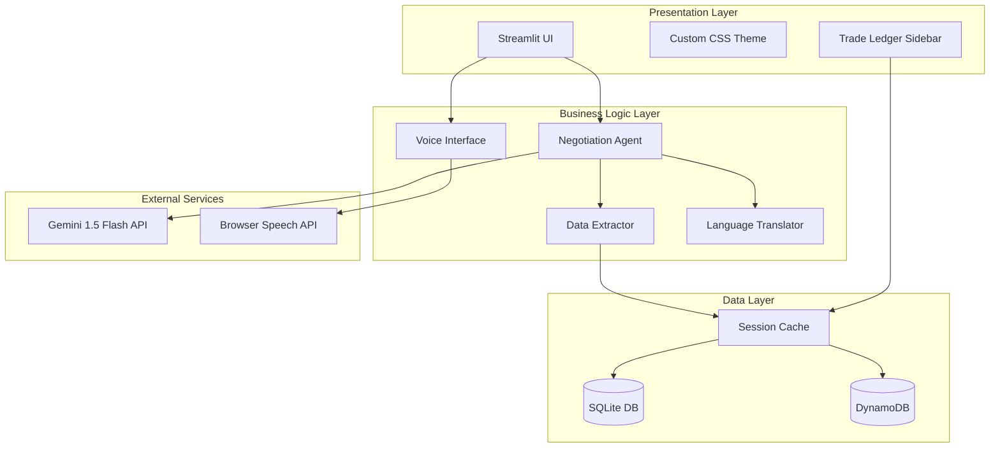

# Design Document: AgriTrade Pro (Prompt Challenge)

## Overview

AgriTrade Pro is a voice-first multilingual AI assistant built using Streamlit for rapid prototyping and deployment. The system leverages Google's Gemini 1.5 Flash for natural language processing and conversation understanding, combined with browser-based speech recognition for voice input. The architecture follows a clean separation between the presentation layer (Streamlit UI), business logic (Negotiation Agent), and data persistence layer (SQLite/DynamoDB).

The system is designed for local vendors in Indian agricultural markets who need to conduct business in their native languages while generating proper digital documentation. The voice-first approach eliminates literacy barriers, while the AI-powered data extraction reduces manual data entry errors.

## Architecture

The system follows a layered architecture pattern optimized for rapid development and deployment:



### Key Architectural Decisions

1. **Streamlit for Frontend**: Chosen for rapid prototyping and built-in state management
2. **Browser Speech API**: Leverages native browser capabilities for voice recognition
3. **Gemini 1.5 Flash**: Provides multilingual understanding and structured data extraction
4. **Dual Storage Strategy**: SQLite for development, DynamoDB for production scaling
5. **Session-based Caching**: Maintains conversation context and real-time updates

## Components and Interfaces

### 1. Streamlit Application (`app.py`)

The main application entry point that orchestrates the UI and coordinates between components.

**Key Responsibilities:**
- Initialize session state and configuration
- Render the main UI with custom theming
- Handle user interactions and button clicks
- Coordinate between voice interface and negotiation agent
- Manage real-time updates to the trade ledger

**Interface:**
```python
class MandiSetuApp:
    def __init__(self, config: AppConfig)
    def render_main_interface(self) -> None
    def handle_negotiation_start(self) -> None
    def update_trade_ledger(self) -> None
    def apply_custom_theme(self) -> None
```

### 2. Negotiation Agent (`negotiation_agent.py`)

The core AI component that processes conversations and extracts trade data using Gemini 1.5 Flash.

**Key Responsibilities:**
- Process multilingual voice input through Gemini API
- Maintain conversation context across exchanges
- Extract structured trade data (product, quantity, price)
- Generate appropriate responses in the user's language
- Handle error cases and fallback scenarios

**Interface:**
```python
class NegotiationAgent:
    def __init__(self, gemini_client: GenerativeModel)
    def process_conversation(self, text: str, language: str) -> ConversationResult
    def extract_trade_data(self, conversation: str) -> TradeData
    def detect_language(self, text: str) -> str
    def translate_response(self, text: str, target_language: str) -> str
    def validate_extraction(self, data: TradeData) -> ValidationResult
```

### 3. Voice Interface (`voice_interface.py`)

Handles voice-to-text conversion using browser-based speech recognition APIs.

**Key Responsibilities:**
- Capture voice input through Streamlit's audio recording
- Convert speech to text using browser APIs
- Provide real-time feedback during recording
- Handle voice recognition errors and retries
- Support multiple Indian languages

**Interface:**
```python
class VoiceInterface:
    def __init__(self, supported_languages: List[str])
    def start_recording(self) -> None
    def stop_recording(self) -> str
    def get_recording_status(self) -> RecordingStatus
    def process_audio(self, audio_data: bytes) -> str
    def set_language(self, language_code: str) -> None
```

### 4. Data Models (`models.py`)

Pydantic models for structured data validation and serialization.

**Core Models:**
```python
class TradeData(BaseModel):
    product_name: str
    quantity: float
    unit: str
    unit_price: float
    total_amount: float
    mandi_cess: float
    timestamp: datetime
    language: str
    conversation_id: str

class DigitalParchi(BaseModel):
    id: str
    trade_data: TradeData
    vendor_id: Optional[str]
    status: ParchiStatus
    created_at: datetime
    updated_at: datetime

class ConversationResult(BaseModel):
    extracted_data: Optional[TradeData]
    response_text: str
    confidence_score: float
    requires_clarification: bool
    missing_fields: List[str]
```

### 5. Database Manager (`database.py`)

Handles data persistence with support for both SQLite and DynamoDB.

**Key Responsibilities:**
- Abstract database operations behind a common interface
- Handle connection management and error recovery
- Provide CRUD operations for trade data
- Support both local SQLite and cloud DynamoDB storage
- Implement data migration and backup strategies

**Interface:**
```python
class DatabaseManager:
    def __init__(self, config: DatabaseConfig)
    def save_parchi(self, parchi: DigitalParchi) -> str
    def get_parchi(self, parchi_id: str) -> Optional[DigitalParchi]
    def list_parchis(self, limit: int = 50) -> List[DigitalParchi]
    def update_parchi(self, parchi_id: str, updates: dict) -> bool
    def delete_parchi(self, parchi_id: str) -> bool
```

### 6. Theme Manager (`theme.py`)

Manages the custom 'Viksit Bharat' theme with Indian tricolor elements.

**Key Responsibilities:**
- Inject custom CSS for saffron and green color scheme
- Ensure proper contrast and accessibility
- Support responsive design for mobile devices
- Handle font loading for regional scripts

**Interface:**
```python
class ThemeManager:
    def __init__(self)
    def apply_viksit_bharat_theme(self) -> None
    def get_custom_css(self) -> str
    def load_regional_fonts(self) -> None
    def ensure_accessibility(self) -> None
```

## Data Models

### Core Data Structures

The system uses Pydantic models for data validation and serialization:

**TradeData**: Represents extracted negotiation information
- `product_name`: String identifier for the traded product
- `quantity`: Numeric quantity with validation for positive values
- `unit`: Standardized unit of measurement (kg, quintal, piece, etc.)
- `unit_price`: Price per unit in INR
- `total_amount`: Calculated total before cess
- `mandi_cess`: 5% cess automatically calculated
- `timestamp`: ISO format timestamp of the transaction
- `language`: Detected language code for the conversation
- `conversation_id`: Unique identifier linking to the conversation

**DigitalParchi**: Complete trade receipt with metadata
- `id`: UUID for unique identification
- `trade_data`: Embedded TradeData object
- `vendor_id`: Optional vendor identification
- `status`: Enum (DRAFT, COMPLETED, CANCELLED)
- `created_at`/`updated_at`: Audit timestamps

**ConversationContext**: Maintains dialogue state
- `session_id`: Unique session identifier
- `messages`: List of conversation exchanges
- `current_language`: Detected user language
- `extraction_attempts`: Number of data extraction tries
- `partial_data`: Incomplete trade information being built

### Database Schema

**SQLite Schema (Development):**
```sql
CREATE TABLE parchis (
    id TEXT PRIMARY KEY,
    product_name TEXT NOT NULL,
    quantity REAL NOT NULL,
    unit TEXT NOT NULL,
    unit_price REAL NOT NULL,
    total_amount REAL NOT NULL,
    mandi_cess REAL NOT NULL,
    language TEXT NOT NULL,
    conversation_id TEXT,
    status TEXT DEFAULT 'COMPLETED',
    created_at TIMESTAMP DEFAULT CURRENT_TIMESTAMP,
    updated_at TIMESTAMP DEFAULT CURRENT_TIMESTAMP
);

CREATE INDEX idx_parchis_created_at ON parchis(created_at DESC);
CREATE INDEX idx_parchis_product ON parchis(product_name);
```

**DynamoDB Schema (Production):**
- **Table Name**: `mandi-setu-parchis`
- **Partition Key**: `id` (String)
- **Sort Key**: `created_at` (String, ISO timestamp)
- **GSI**: `product-index` on `product_name`
- **TTL**: Optional expiration for data retention policies

## Correctness Properties

*A property is a characteristic or behavior that should hold true across all valid executions of a system—essentially, a formal statement about what the system should do. Properties serve as the bridge between human-readable specifications and machine-verifiable correctness guarantees.*

### Property Analysis and Reflection

Before defining the correctness properties, I need to analyze the acceptance criteria from the requirements document to identify which ones can be tested as properties versus examples or edge cases.

<function_calls>
<invoke name="prework">
<parameter name="featureName">mandi-setu

### Property Reflection

After analyzing all acceptance criteria, I identified several areas where properties can be consolidated to eliminate redundancy:

1. **Data extraction properties (3.1, 3.2, 3.3)** can be combined into a comprehensive extraction property
2. **UI update properties (5.1, 5.2, 5.3)** can be consolidated into a single real-time update property  
3. **Performance properties (9.1, 9.2, 9.3, 9.4)** can be grouped by component type
4. **Error handling properties (10.1, 10.2, 10.3, 10.4)** can be consolidated into resilience patterns

### Core Correctness Properties

Based on the prework analysis, here are the key properties that ensure system correctness:

**Property 1: Voice Interface State Consistency**
*For any* user interaction with the voice interface, when the 'Start Negotiation' button is clicked, the system should activate voice recording and provide appropriate visual feedback
**Validates: Requirements 1.1, 1.3**

**Property 2: Multilingual Processing Round Trip**
*For any* supported regional language input, the system should detect the language, process the content, and respond in the same detected language
**Validates: Requirements 2.1, 2.2, 2.3**

**Property 3: Complete Data Extraction**
*For any* negotiation conversation containing product, quantity, and price information, the Negotiation Agent should extract all three data points accurately
**Validates: Requirements 3.1, 3.2, 3.3**

**Property 4: Mathematical Calculation Accuracy**
*For any* valid quantity and unit price combination, the system should calculate total amount correctly and add exactly 5% Mandi Cess
**Validates: Requirements 4.2, 4.3**

**Property 5: Digital Parchi Completeness**
*For any* generated Digital Parchi, it should contain all required fields: timestamp, product name, quantity with units, unit price, total amount, and Mandi Cess
**Validates: Requirements 4.5**

**Property 6: Real-time Trade Ledger Updates**
*For any* trade data extraction or Digital Parchi completion, the Trade Ledger should update immediately and maintain chronological ordering
**Validates: Requirements 5.2, 5.3, 5.4**

**Property 7: Data Persistence Round Trip**
*For any* Digital Parchi created, storing it to the database and then retrieving it should produce an equivalent object
**Validates: Requirements 7.1, 7.4**

**Property 8: Conversation Context Preservation**
*For any* multi-turn conversation, the Negotiation Agent should maintain context across all exchanges within the same session
**Validates: Requirements 8.2**

**Property 9: Error Recovery Consistency**
*For any* system error (voice recognition, AI processing, database, or network), the system should provide appropriate recovery options and maintain user-friendly error messaging
**Validates: Requirements 10.1, 10.2, 10.3, 10.5**

**Property 10: Performance Bounds**
*For any* system operation, response times should stay within specified bounds: voice feedback ≤ 2s, data extraction ≤ 5s, UI updates ≤ 1s, database operations ≤ 500ms
**Validates: Requirements 9.1, 9.2, 9.3, 9.4**

## Error Handling

The system implements comprehensive error handling across all layers:

### Voice Interface Errors
- **Speech Recognition Failures**: Provide retry options with visual feedback
- **Audio Device Issues**: Graceful fallback to text input mode
- **Language Detection Errors**: Default to Hindi with user notification
- **Network Timeouts**: Cache audio locally and retry processing

### AI Processing Errors
- **Gemini API Failures**: Implement exponential backoff with circuit breaker pattern
- **Rate Limiting**: Queue requests and implement fair usage policies
- **Invalid Responses**: Validate AI outputs and request regeneration
- **Context Loss**: Maintain conversation history in session storage

### Data Layer Errors
- **Database Connection Failures**: Implement connection pooling and retry logic
- **Data Validation Errors**: Provide specific field-level error messages
- **Storage Quota Exceeded**: Implement data archival and cleanup policies
- **Concurrent Access Issues**: Use optimistic locking for data consistency

### Network Resilience
- **Offline Mode**: Cache essential data for offline operation
- **Poor Connectivity**: Implement request queuing and background sync
- **Service Unavailability**: Provide degraded functionality with local processing
- **Data Synchronization**: Implement conflict resolution for concurrent updates

## Testing Strategy

The testing approach combines unit tests for specific scenarios with property-based tests for comprehensive coverage:

### Unit Testing Approach
- **Component Isolation**: Test individual components with mocked dependencies
- **Edge Case Coverage**: Focus on boundary conditions and error scenarios
- **Integration Points**: Verify correct interaction between system components
- **UI Component Testing**: Validate Streamlit components and user interactions

### Property-Based Testing Configuration
- **Framework**: Use Hypothesis for Python property-based testing
- **Test Iterations**: Minimum 100 iterations per property test
- **Data Generation**: Custom generators for Indian language text, trade data, and audio samples
- **Shrinking Strategy**: Implement custom shrinking for complex data structures

### Test Categories

**Voice Interface Tests:**
- Unit tests for audio processing edge cases
- Property tests for voice-to-text consistency across languages
- Integration tests for browser speech API compatibility

**AI Processing Tests:**
- Unit tests for specific conversation examples
- Property tests for data extraction accuracy across conversation types
- Mock tests for Gemini API error scenarios

**Data Layer Tests:**
- Unit tests for database schema validation
- Property tests for data persistence round-trip consistency
- Performance tests for database operation timing

**UI Tests:**
- Unit tests for theme application and responsive design
- Property tests for real-time update consistency
- Accessibility tests for regional script support

### Property Test Implementation
Each property test will be tagged with the format:
**Feature: mandi-setu, Property {number}: {property_text}**

Example property test structure:
```python
@given(trade_data=trade_data_strategy())
def test_digital_parchi_completeness(trade_data):
    """Feature: mandi-setu, Property 5: Digital Parchi Completeness"""
    parchi = create_digital_parchi(trade_data)
    assert all(field in parchi.dict() for field in REQUIRED_FIELDS)
    assert parchi.mandi_cess == parchi.total_amount * 0.05
```

### Continuous Integration
- **Automated Testing**: Run all tests on every commit
- **Performance Monitoring**: Track response times and resource usage
- **Accessibility Validation**: Automated checks for regional script rendering
- **Security Scanning**: Regular dependency and code security audits